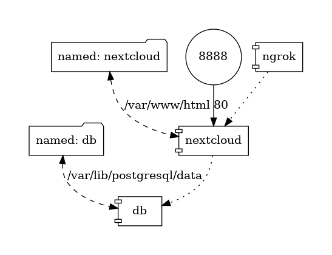

# Nextcloud

A Nextcloud docker-compose based environment configuration



## Requirements

- Docker
- Docker Compose
- Ngrok account

## Setup

Rename `nextcloud.env-template` to `nextcloud.env` and update the environment variables
to values that makes sense to your use case. Do the same with `ngrok.env-template` and `db.env-template`.

More info on environement variables can be found here: https://github.com/nextcloud/docker

## Running

Running docker-compose is all you need to do to setup nextcloud, using postgres as the DB and ngrok as 
a way to make your personal cloud publicly accessible through the internet.

```
docker-compose up
```

## Warnings

- This isn't a "production grade" setup
- There are no guarantees that it fits your personal use case
